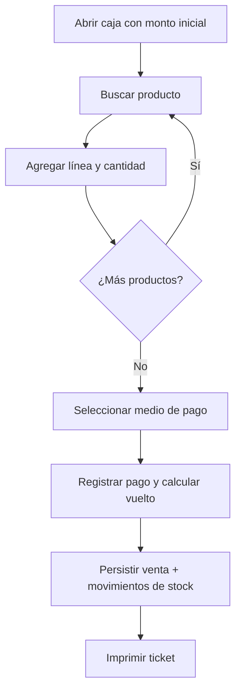
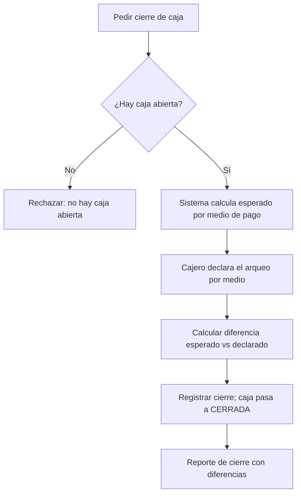
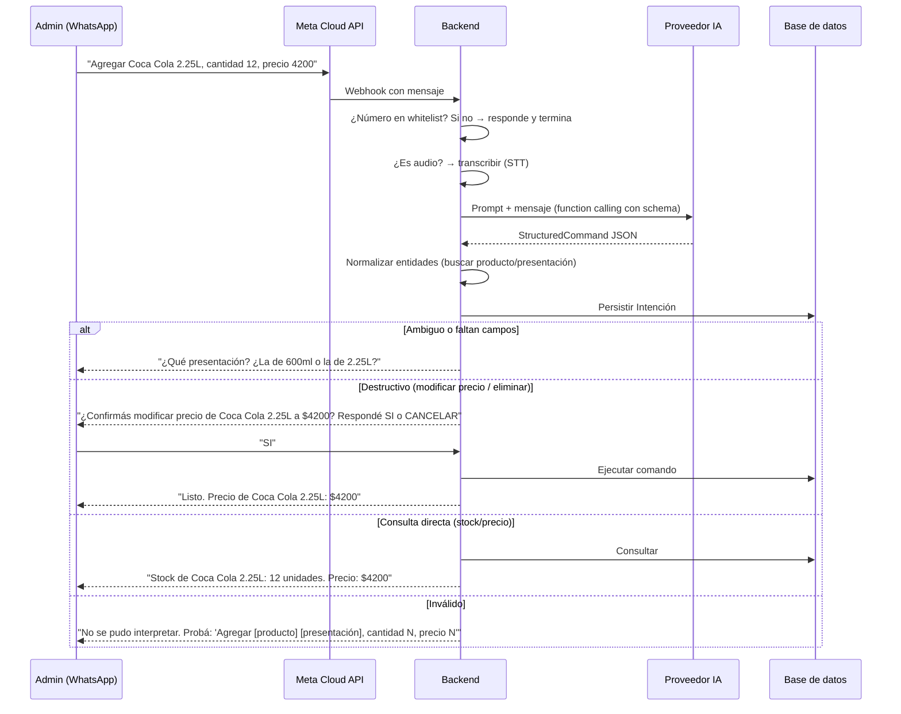
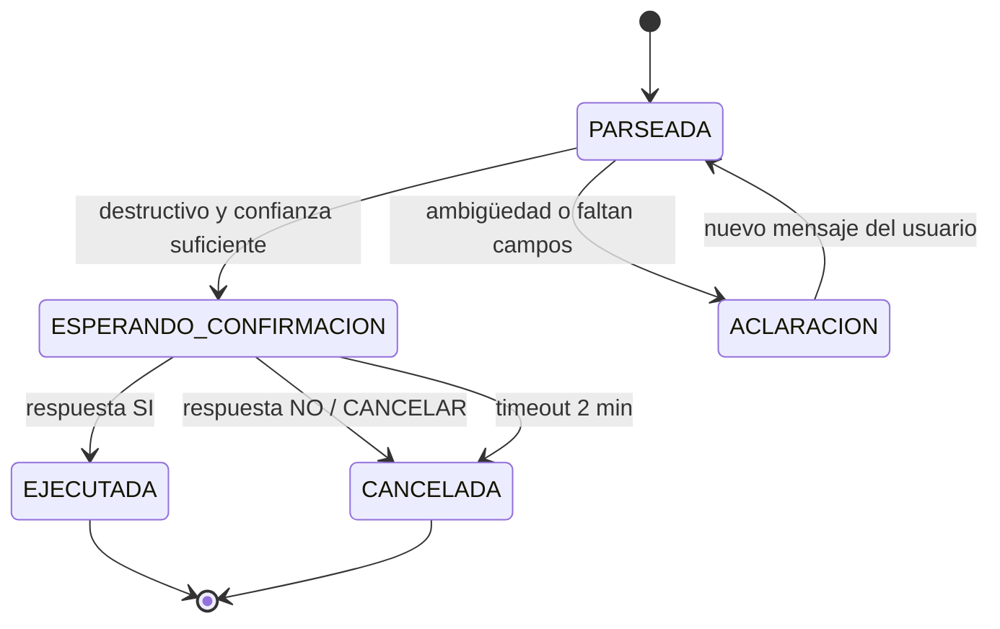

# 04 - Casos de uso

## Actores

| Actor | Descripción | Permisos clave |
|---|---|---|
| **Admin** | Dueño del comercio. Gestiona todo. También puede atender la caja. Opera por panel web y WhatsApp. | Todos (`07-seguridad.md`) |
| **Cajero** | Atiende la caja con el POS desktop. | Solo vender, cobrar, consultar, abrir/cerrar caja |
| **Sistema** | Procesa ventas, stock, cajas y comandos de WhatsApp. | — |

## Casos de uso por actor

### Admin (panel web)

| ID | Caso de uso | RF |
|---|---|---|
| `CU-ADM-001` | Iniciar sesión | RF-022 |
| `CU-ADM-002` | Gestionar categorías (alta, edición, baja lógica) | RF-001 |
| `CU-ADM-003` | Gestionar productos y presentaciones (alta, edición, precio, costo, código, baja lógica) | RF-002…007 |
| `CU-ADM-004` | Cargar stock manualmente con costo | RF-008 |
| `CU-ADM-005` | Registrar ajustes de stock con motivo | RF-009 |
| `CU-ADM-006` | Gestionar usuarios y roles | RF-021 |
| `CU-ADM-007` | Gestionar whitelist de WhatsApp | RF-040 |
| `CU-ADM-008` | Ver reportes (ventas, ganancias, stock, cierres, ranking, auditoría) | RF-035 |
| `CU-ADM-009` | Exportar reportes a CSV | RF-036 |
| `CU-ADM-010` | Configurar el comercio y el bot | RF-039 |
| `CU-ADM-011` | Consultar auditoría | RF-038 |

### Admin y Cajero (POS desktop)

| ID | Caso de uso | RF |
|---|---|---|
| `CU-CAJ-001` | Abrir caja con monto inicial | RF-013 |
| `CU-CAJ-002` | Buscar producto (nombre, código, escaneo) | RF-014 |
| `CU-CAJ-003` | Consultar precio | RF-015 |
| `CU-CAJ-004` | Registrar venta (líneas y cantidades) | RF-016 |
| `CU-CAJ-005` | Cobrar (efectivo con vuelto, tarjeta, QR, mixto) | RF-017 |
| `CU-CAJ-006` | Imprimir ticket no fiscal | RF-018 |
| `CU-CAJ-007` | Cerrar caja con arqueo | RF-019 |
| `CU-CAJ-008` | Ver el cierre del propio turno | RF-035 (parcial) |

### Admin (WhatsApp)

| ID | Caso de uso | RF |
|---|---|---|
| `CU-WA-001` | Consultar stock | RF-027 |
| `CU-WA-002` | Consultar precio | RF-027 |
| `CU-WA-003` | Agregar stock (con costo opcional) | RF-028 |
| `CU-WA-004` | Crear producto con presentación | RF-029 |
| `CU-WA-005` | Modificar precio (con confirmación) | RF-030 |
| `CU-WA-006` | Eliminar/desactivar producto (con confirmación) | RF-031 |
| `CU-WA-007` | Listar productos por categoría o texto | RF-027 |

## Flujo general del POS (venta)

## Flujo del cierre de caja

## Flujo de WhatsApp (texto o audio)

## Máquina de estados de una intención

## Casos de uso de WhatsApp detallados

### CU-WA-003 — Agregar stock

**Mensaje de ejemplo:** `"Agregar Coca Cola 2.25L, cantidad 12, precio 4200."`

1. Validar whitelist.
2. Parsear a `StructuredCommand` (`ACCION=AGREGAR_STOCK`).
3. Resolver la presentación. Si hay varios candidatos → preguntar (nunca elegir al azar).
4. Validar `cantidad > 0`.
5. Si el campo numérico "precio" no especifica si es venta o costo → el bot pregunta (P8).
6. Ejecutar: crear `MovimientoStock` `ENTRADA_MANUAL`.
7. Responder con confirmación y stock resultante.

### CU-WA-005 — Modificar precio

**Mensaje de ejemplo:** `"Cambiar precio de Coca Cola 2.25L a 4300."`

1. Parsear y resolver presentación.
2. Acción destructiva → `ESPERANDO_CONFIRMACION`.
3. El usuario confirma → actualizar `precio_venta`.
4. Registrar auditoría con mensaje original y comando.

### CU-WA-006 — Eliminar/desactivar

1. Parsear y resolver producto/presentación.
2. Si tiene stock > 0 → proponer desactivación (no eliminación física) y advertir el stock.
3. Requerir confirmación explícita.
4. Confirmado → desactivar y registrar auditoría.

## Reglas de interacción del bot

- Un comando por mensaje (v1). Dos intenciones → pedir separarlas.
- Palabras de confirmación: `SI`, `CONFIRMO`, `OK`, `DALE`. Cancelación: `NO`, `CANCELAR`, `CANCELO`.
- Mensaje irreconocible → respuesta de ayuda con ejemplos.
- Confirmaciones asociadas al mismo número de WhatsApp que originó la intención.
