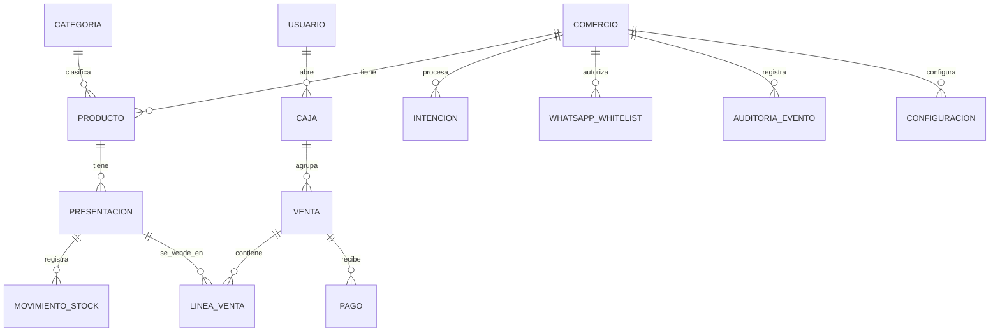

# 05 - Modelo de datos

Diseño de las entidades persistentes, relaciones, restricciones e índices. No es implementación: define *qué* se persiste y *cómo se relaciona*.

Convenciones:

- **Montos en centavos (enteros)**, moneda ARS. Nunca punto flotante (RNF-009).
- **UUIDs generados en el cliente** para permitir idempotencia en el sync offline.
- **`client_generated`** distingue registros creados offline por el POS (para resoluciones de sync).
- El stock actual **no** es una columna editable: se deriva de los movimientos. `stock_snapshot` es solo un cache legible/recalculable.

## Diagrama entidad-relación

## Entidades persistentes

### Comercio

| Campo | Tipo | Notas |
|---|---|---|
| id | uuid PK | |
| nombre | varchar(120) | Nombre público |
| created_at / updated_at | timestamptz | |

### Categoria

| Campo | Tipo | Notas |
|---|---|---|
| id | uuid PK | |
| comercio_id | uuid FK | |
| nombre | varchar(80) | Único por comercio |
| activa | bool | Baja lógica |

### Producto

| Campo | Tipo | Notas |
|---|---|---|
| id | uuid PK | |
| comercio_id | uuid FK | |
| categoria_id | uuid FK null | |
| nombre | varchar(120) | Genérico: "Coca Cola" |
| nombre_normalizado | varchar(120) | Sin acentos, mayúsculas (RF-007) |
| activo | bool | Baja lógica |

### Presentacion

| Campo | Tipo | Notas |
|---|---|---|
| id | uuid PK | |
| producto_id | uuid FK | |
| nombre | varchar(80) | "2.25L", "600ml", "97g" |
| codigo_barras | varchar(32) null | Único entre activas |
| precio_venta | integer | Centavos, > 0 |
| precio_costo | integer null | Centavos |
| activa | bool | Baja lógica |
| stock_snapshot | integer | Cache de lectura (recalculable) |
| stock_minimo | integer null | Alerta opcional |

### MovimientoStock

| Campo | Tipo | Notas |
|---|---|---|
| id | uuid PK | Inmutable (INV-005) |
| presentacion_id | uuid FK | |
| tipo | enum | `ENTRADA_MANUAL`, `AJUSTE`, `VENTA`, `DEVOLUCION` |
| cantidad | integer | + entrada, − salida |
| motivo | varchar(200) null | Obligatorio en `AJUSTE` |
| venta_id | uuid null | Si tipo = `VENTA` |
| usuario_id | uuid null | Quién lo generó |
| origen | enum | `POS`, `WEB`, `WHATSAPP` |
| created_at | timestamptz | |

### Usuario

| Campo | Tipo | Notas |
|---|---|---|
| id | uuid PK | |
| comercio_id | uuid FK | |
| nombre | varchar(80) | |
| username | varchar(40) | Único |
| password_hash | varchar(200) | BCrypt |
| rol | enum | `ADMIN`, `CAJERO` |
| activo | bool | |

### Caja

| Campo | Tipo | Notas |
|---|---|---|
| id | uuid PK | |
| comercio_id | uuid FK | |
| usuario_id | uuid FK | Cajero que la abrió |
| fecha_apertura | timestamptz | |
| monto_inicial | integer | Centavos |
| fecha_cierre | timestamptz null | |
| monto_esperado | integer null | Al cierre |
| monto_declarado | integer null | Arqueo |
| diferencia | integer null | Declarado − esperado |
| estado | enum | `ABIERTA`, `CERRADA` |

### Venta

| Campo | Tipo | Notas |
|---|---|---|
| id | uuid PK | |
| comercio_id | uuid FK | |
| caja_id | uuid FK | |
| numero | integer | Correlativo por comercio |
| total | integer | Centavos |
| fecha | timestamptz | |
| client_generated | bool | Sync offline |

### LineaVenta

| Campo | Tipo | Notas |
|---|---|---|
| id | uuid PK | |
| venta_id | uuid FK | |
| presentacion_id | uuid FK | |
| producto_nombre / presentacion_nombre | varchar | Snapshots legibles |
| cantidad | integer | > 0 |
| precio_unitario | integer | Snapshot (INV-007) |
| subtotal | integer | cantidad × precio_unitario |

### Pago

| Campo | Tipo | Notas |
|---|---|---|
| id | uuid PK | |
| venta_id | uuid FK | |
| medio | enum | `EFECTIVO`, `TARJETA`, `TRANSFERENCIA_QR` |
| monto | integer | Centavos |
| vuelto | integer | Solo efectivo, ≥ 0 |

### Intencion

| Campo | Tipo | Notas |
|---|---|---|
| id | uuid PK | |
| comercio_id | uuid FK | |
| whatsapp_numero | varchar(20) | |
| texto_original | text | Mensaje o transcripción |
| fue_audio | bool | |
| structured_command | json | Comando del pipeline |
| estado | enum | `RECIBIDA`, `PARSEADA`, `ACLARACION`, `ESPERANDO_CONFIRMACION`, `EJECUTADA`, `CANCELADA`, `RECHAZADA`, `ERROR` |
| decision | varchar(100) null | Motivo de la decisión |
| resultado | json null | Resultado de la ejecución |
| expira_en | timestamptz null | Confirmaciones |
| created_at / updated_at | timestamptz | |

### WhatsappWhitelist

| Campo | Tipo | Notas |
|---|---|---|
| id | uuid PK | |
| comercio_id | uuid FK | |
| whatsapp_numero | varchar(20) | Único por comercio |
| activo | bool | |

### AuditoriaEvento

| Campo | Tipo | Notas |
|---|---|---|
| id | bigserial PK | Append-only (INV-005) |
| comercio_id | uuid FK | |
| canal | enum | `POS`, `WEB`, `WHATSAPP` |
| actor | varchar(80) | Usuario o `whatsapp:+549…` |
| tipo | varchar(50) | Ej: `VENTA.CREAR` |
| detalle | json | Datos de la operación |
| intencion_id | uuid null | Si vino de WhatsApp |
| created_at | timestamptz | |

### Configuracion

| Campo | Tipo | Notas |
|---|---|---|
| comercio_id | uuid PK/FK | |
| clave | varchar(80) PK | |
| valor | text | |

Claves planificadas: `bot.nombre`, `bot.mensaje_bienvenida`, `bot.timeout_confirmacion_segundos`, `sync.intervalo_segundos`, `pos.ticket_pie`, `stock.alerta_minima_global`.

## Restricciones e índices

- **Índices:** `(comercio_id, nombre_normalizado)` en Producto; `(producto_id)`, `(codigo_barras)`, `(comercio_id, activa)` en Presentacion; `(presentacion_id, created_at)`, `(venta_id)` en MovimientoStock; `(comercio_id, fecha)` en Venta; `(whatsapp_numero, estado)` en Intencion.
- **Unicidad:** `(producto_id, nombre)` en Presentacion (INV-003); username en Usuario; `codigo_barras` entre activas; `whatsapp_numero` por comercio en whitelist.
- **Caja única activa:** índice único parcial `(comercio_id)` donde `estado = ABIERTA` (INV-002).
- **Stock negativo:** no se garantiza con constraint a nivel de base; se garantiza por aplicación con validación sobre la suma proyectada y lock de fila de la presentación al aplicar movimientos (INV-001).

## Decisiones importantes

1. **Stock como ledger** (`MovimientoStock`) — habilita sync offline conmutativo (ver `08-sync-offline.md`) y trazabilidad (P3).
2. **Snapshots en `LineaVenta`** — los cambios de precio no re-escriben el pasado; reportes de ganancia correctos.
3. **`client_generated` + UUIDs cliente** — base de la idempotencia del sync.
4. **Montos en centavos enteros** — sin errores de redondeo (RNF-009).
5. **Baja lógica** (`activa`) en catálogo y usuarios — cumple P3.
6. **Auditoría y movimientos inmutables** — solo alta (INV-005).

## Migraciones

- Migraciones separadas por proveedor (PostgreSQL cloud y SQLite local) con el mismo schema lógico.
- Diferencias físicas permitidas (p. ej. tipo `json`).
