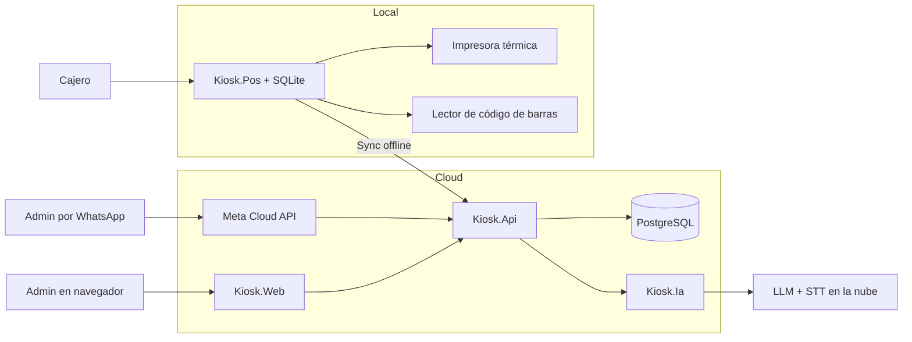

# 06 - Arquitectura

## Estilo

**Clean Architecture** en .NET con CQRS-lite (separación conceptual de lectura y escritura, sin bus de mensajería en v1). La regla de dependencia apunta al centro: el dominio no conoce infraestructura (P1, P6, P7).

```
┌──────────────────────────────────────────────────────┐
│ Presentation                                          │
│  • POS desktop (WPF)                                  │
│  • Panel web (Blazor)                                 │
│  • Webhook y respuestas de WhatsApp                   │
├──────────────────────────────────────────────────────┤
│ Application (casos de uso)                            │
│  • Comandos/consultas, puertos (interfaces), orquest. │
├──────────────────────────────────────────────────────┤
│ Domain                                                │
│  • Entidades, reglas de negocio, invariantes          │
├──────────────────────────────────────────────────────┤
│ Infrastructure                                        │
│  • Persistencia (PostgreSQL + SQLite)                 │
│  • Meta Cloud API (WhatsApp)                          │
│  • IA (LLM + STT)                                     │
│  • Impresión térmica                                  │
└──────────────────────────────────────────────────────┘
```

## Módulos (proyectos .NET)

| Módulo | Responsabilidad |
|---|---|
| `Kiosk.Domain` | Entidades, reglas, invariantes, movimientos de stock. Sin dependencias. |
| `Kiosk.Application` | Casos de uso, puertos (interfaces), validaciones orquestadas. |
| `Kiosk.Infrastructure` | Implementaciones: EF Core, PostgreSQL/SQLite, Meta Cloud API, IA, impresión. |
| `Kiosk.Api` | API HTTP: panel web, POS (sync) y webhook de WhatsApp. |
| `Kiosk.Pos` | POS desktop offline-first. |
| `Kiosk.Web` | Panel web del Admin. |
| `Kiosk.Ia` | Pipeline de IA (STT + LLM + schema). |

## Diagrama de componentes



## Flujo de datos

- **POS:** escribe local (SQLite) siempre; sincroniza con el API cuando hay conexión (ver `08-sync-offline.md`).
- **Panel web y API:** leen/escriben contra PostgreSQL. El stock se calcula desde los movimientos sincronizados.
- **WhatsApp:** el webhook firmado llega al API → valida whitelist (antes de gastar tokens) → arma la intención → pipeline de IA → el backend decide → responde por Meta Cloud API.

## Puertos clave (interfaces en Application)

| Puerto | Implementaciones |
|---|---|
| `IStockLedger` | Lectura/escritura de movimientos de stock. |
| `IProductRepository` | CRUD de productos y presentaciones. |
| `ISaleService` | Registro de ventas y caja. |
| `IIntentService` | Ciclo de vida de intenciones de WhatsApp. |
| `IIaParser` | Texto → `StructuredCommand` (P1). |
| `IStt` | Audio → texto. |
| `IWhatsAppSender` | Envío de respuestas. |
| `ITicketPrinter` | Tickets no fiscales. |

El dominio depende de estas interfaces, nunca de implementaciones (P6).

## Decisiones de arquitectura (ADR)

### ADR-001 — La IA es un adapter, nunca lógica de negocio
**Estado:** Aceptada. **Contexto:** el diferencial es el parseo con IA; si se acopla al dominio, cualquier cambio de proveedor rompe reglas. **Decisión:** `Kiosk.Ia` solo produce `StructuredCommand` (DTO). **Consecuencias:** el contrato del DTO debe ser estable y versionado.

### ADR-002 — Stock como libro de movimientos
**Estado:** Aceptada. **Contexto:** sync offline y concurrencia. **Decisión:** stock = suma de `MovimientoStock` (inmutables). **Consecuencias:** lectura por agregación + `stock_snapshot` cacheado y recalculable.

### ADR-003 — Offline-first con SQLite local y operaciones idempotentes
**Estado:** Aceptada. **Contexto:** el comercio nunca deja de vender (P5). **Decisión:** POS persiste local y sincroniza con `operationId`. Detalle en `08-sync-offline.md`. **Consecuencias:** complejidad acotada en v1 a una caja activa.

### ADR-004 — API oficial de WhatsApp Business
**Estado:** Aceptada. **Contexto:** producción seria y legalidad. **Decisión:** Meta Cloud API. **Consecuencias:** costo por mensaje, número verificado y plantillas para el primer contacto.

### ADR-005 — Una caja activa por comercio en v1
**Estado:** Aceptada. **Contexto:** sync offline y stock concurrente. **Decisión:** máximo una caja activa. **Consecuencias:** el modelo admite varias cajas en el futuro; en v1 evita conflictos de stock.

### ADR-006 — Moneda fija ARS en centavos y sin facturación fiscal en v1
**Estado:** Aceptada. **Decisión:** montos enteros en centavos; sin módulo fiscal. **Consecuencias:** facturación futura es adición, no refactor.

## Consideraciones de escalabilidad

- API stateless: escalable horizontalmente (RNF-012).
- Webhooks de WhatsApp procesados con cola interna para garantizar entrega y orden por número.
- Panel web y POS autentican por separado contra el API.
- Crecimiento futuro a varias cajas → reservas de stock en sync (fuera de alcance v1).

## Infraestructura propuesta

| Componente | Elección | Justificación |
|---|---|---|
| Base cloud | PostgreSQL managed | Relacional, robusta, disponibilidad |
| Base local | SQLite | Sin servidor, embebida en el POS |
| API + panel | Contenedores en host 24/7 | WhatsApp requiere backend siempre encendido |
| WhatsApp | Meta Cloud API | Oficial, legal, estable |
| IA | LLM por API + STT | Rápido de implementar, reemplazable (P6) |
| POS | Instalador Windows | Hardware local del kiosco |
