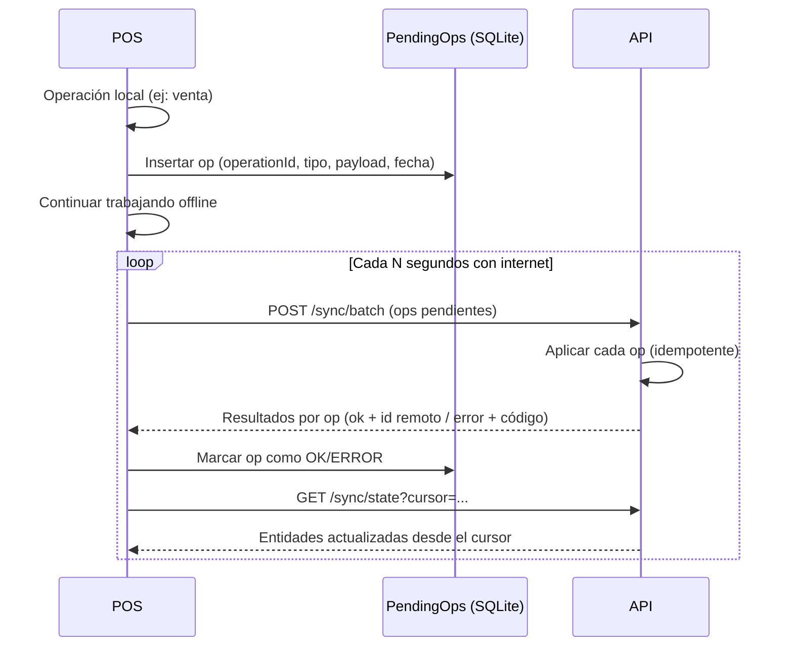

# 08 - Sync offline

## Objetivo

El comercio **nunca deja de vender** por falta de internet (P5, RNF-003). El POS registra todo localmente y sincroniza con el cloud cuando hay conectividad, sin duplicar ni perder operaciones (P3, RNF-004).

## Principios

1. **El POS es la fuente de verdad de su propio turno.** Con caja abierta, vende 100% offline.
2. **Operaciones idempotentes.** El cliente genera el `operationId`; reintentar nunca duplica (RNF-004).
3. **Stock como movimientos.** Los movimientos de venta son sumas conmutativas: se aplican en cualquier orden (ADR-002).
4. **Una caja activa por comercio** acota el universo de conflictos en v1 (ADR-005).

## Componentes

- **Almacén local:** SQLite con el mismo schema lógico del cloud.
- **Cola de operaciones:** tabla local `PendingOps` (operaciones aún no confirmadas por el servidor).
- **Sync engine:** proceso del POS que envía pendientes y recibe actualizaciones.

## Flujo del sync

## Idempotencia

- Cada operación lleva `operationId` (UUID) y tipo.
- El servidor registra los `operationId` ya aplicados; reintentos devuelven el resultado original sin re-ejecutar.

### Operaciones sincronizadas en v1

| Operación | Payload | Resolución |
|---|---|---|
| Venta + líneas + pagos | Venta completa con UUIDs | Unidad atómica; duplicado se ignora; movimientos de stock únicos por `venta_id` |
| Movimiento de stock (ajuste) | presentación, cantidad, motivo | Se aplica si no deja stock negativo proyectado |
| Cierre de caja | arqueo | Se aplica una sola vez; marca fin de turno |

## Resolución de conflictos

### Stock
- No hay conflicto entre ventas: la suma es conmutativa.
- **Stock negativo:** al aplicar, el servidor valida contra la suma proyectada. Un ajuste que dejaría stock negativo se rechaza con error y el POS muestra la alerta (INV-001; nunca se corrompe el dato).
- `stock_snapshot` es cache recalculable, nunca fuente de verdad.

### Catálogo
- En v1, productos y presentaciones se crean/editan **solo en el cloud** (panel web o WhatsApp). El POS recibe el catálogo por cursor.
- Elimina el caso difícil (editar el mismo producto en dos lados a la vez).

### Caja y turno
- La caja se abre en el POS (local) y se registra en el cloud al sincronizar. El índice único por comercio con `estado = ABIERTA` garantiza una sola caja activa (INV-002).
- Si el cloud ya tiene una caja abierta (ej: el Admin la cerró desde el panel), la apertura local se rechaza y el POS debe cerrar la local antes de abrir otra.

## Reconciliación y estados del POS

| Estado | Comportamiento |
|---|---|
| Online | Sync continuo (15-30 s) |
| Offline | Vende normal; alertas de conexión y estado de la cola |
| Reconecta | Envía la cola en orden de creación; luego recibe el cursor actualizado |
| Error de operación | La op fallida queda en `ERROR` visible en el POS; no bloquea las siguientes |

## Garantías

- **No se pierden ventas:** todo lo registrado localmente llega al cloud eventualmente.
- **No se duplican ventas:** idempotencia por `operationId`.
- **Stock nunca negativo:** validado en el servidor al aplicar.
- **Consistencia eventual** del cloud (RNF-010): el panel puede ver atraso de segundos mientras el POS no sincroniza; el POS local es consistente en su turno.

## Detalles de implementación

- Endpoints: `POST /sync/batch`, `GET /sync/state?cursor=...`, `POST /sync/ack`.
- Cursor = versión/timestamp por entidad; el POS pide "lo que cambió desde X".
- `PendingOps` persiste en SQLite: sobrevive reinicios (RNF-016).
- Contingencia: si la PC del POS se pierde, las ventas locales no sincronizadas se pierden (limitación aceptada en v1; mitigada con sync frecuente y backup del archivo SQLite).
